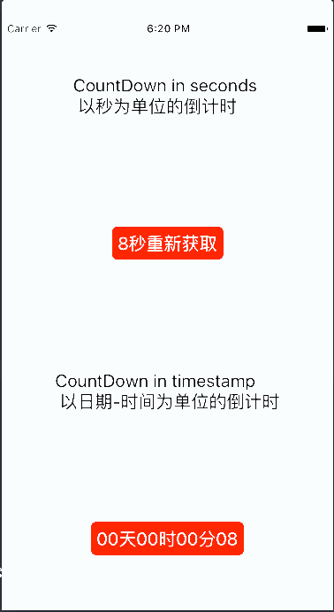

## 用法

```JavaScript
import {CountDownText} from 'react-native-sk-countdown';

<CountDownText
    style={styles.cd}
    countType='seconds' // 计时类型：seconds / date
    auto={true} // 自动开始
    afterEnd={() => {}} // 结束回调
    timeLeft={10} // 正向计时 时间起点为0秒
    step={-1} // 计时步长，以秒为单位，正数则为正计时，负数为倒计时
    startText='获取验证码' // 开始的文本
    endText='获取验证码' // 结束的文本
    intervalText={(sec) => sec + '秒重新获取'} // 定时的文本回调
  />

<CountDownText // 倒计时
    style={styles.cd}
    countType='date' // 计时类型：seconds / date
    auto={true} // 自动开始
    afterEnd={() => {}} // 结束回调
    timeLeft={10} // 正向计时 时间起点为0秒
    step={-1} // 计时步长，以秒为单位，正数则为正计时，负数为倒计时
    startText='' // 开始的文本
    endText='' // 结束的文本
    intervalText={(date, hour, min, sec) => date + '天' + hour + '时' + min + '分' + sec} // 定时的文本回调
  />

```



## Prop

| Prop | Description | Default |
|---|---|---|
|**`countType`**|Countdown type, one of 'seconds' and 'date'. |*None*|
|**`auto`**|Whether to start countdown right now. |*false*|
|**`timeLeft`**|Seconds lefted to countdown. |*None*|
|**`step`**|Number to increment in each step. |*-1*|
|**`startText`**|Text before countdown. |*None*|
|**`endText`**|Text after countdown. |*None*|
|**`intervalText`**|A function to reture a text during countdown. |*None*|
|**`afterEnd`**|A callback function after countdown. |*None*|

##Methods

| Method | Description | Params |
|---|---|---|
|**`start`**|start countdown. |*None*|
|**`end`**|finish countdown. |*None*|


## 后记

大量借鉴 [https://github.com/shigebeyond/react-native-sk-countdown](https://github.com/shigebeyond/react-native-sk-countdown) 项目

其实说白了只是在原来代码上优化改进，主要兼容新版的React-Native 和用 `ES6`语法改写。 开发与使用是在 `.44` 版本